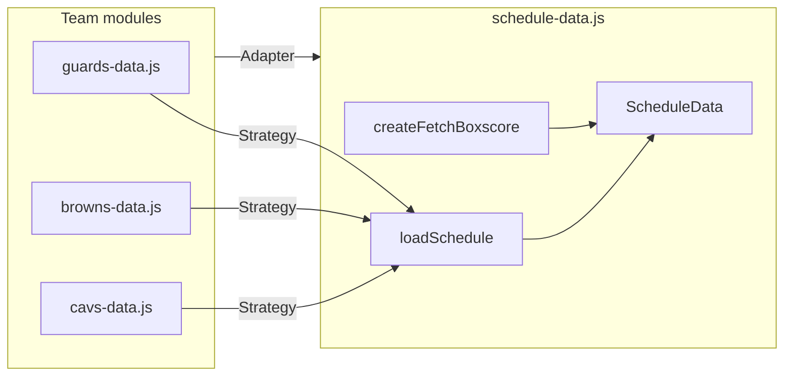

# Client Data Layer Refactor Plan

Extract shared schedule and box score logic into a single module. Team-specific files retain only league configuration and ESPN-to-UI adapters. **Public API and runtime behavior remain unchanged.**

---

## Objectives

- **DRY:** Remove duplicated date formatting, logo extraction, schedule fetching, and summary fetching across team modules.
- **SOLID alignment:** Single responsibilities, injected strategies, extension without modifying shared code.
- **Zero UI changes:** Presentation layer (HTML/CSS) is untouched.

---

## SOLID mapping

| Principle | Application |
|-----------|-------------|
| **Single Responsibility** | `schedule-data.js` owns ESPN fetch/normalize logic. Team files own league-specific record parsing and box score mapping. |
| **Open/Closed** | Shared module is closed for modification. New leagues add a thin team file without editing `schedule-data.js`. |
| **Liskov Substitution** | All `mapSummaryToBoxscore` implementations satisfy the same contract: `(summary, game?) → Array<teamRow> \| null`. |
| **Interface Segregation** | Team files import only the helpers they need from `ScheduleData`. |
| **Dependency Inversion** | `loadSchedule(apiBase, teamId, getRecordFn)` and `createFetchBoxscore(apiBase, mapper)` depend on function contracts, not league-specific code. |

---

## Design patterns

| Pattern | Location | Role |
|---------|----------|------|
| **Strategy** | `loadSchedule`, `createFetchBoxscore` | Inject record extraction and box score mapping per league. |
| **Adapter** | `mapSummaryToBoxscore` in each `*-data.js` | Map ESPN summary JSON to the box score table schema. |
| **Factory** | `createFetchBoxscore` | Return a configured `fetchBoxscoreForGame` function per league. |
| **Template Method** | Event→game mapping in `loadSchedule` | Fixed pipeline; variable step supplied by `getRecordFn`. |
| **Facade** | `ScheduleData` namespace | Single entry point hiding fetch and parse details. |



---

## Current duplication

| Logic | Guardians | Browns | Cavs |
|-------|-----------|--------|------|
| `formatDate` | duplicated | duplicated | duplicated |
| `getTeamLogo` | duplicated | duplicated | duplicated |
| Record extraction | MLB shape | NFL shape | NBA shape |
| Event → game mapping | duplicated | duplicated | duplicated |
| `computeDefaultIndex` | duplicated | duplicated | duplicated |
| Summary fetch + map | same pattern | same pattern | same pattern |

**League-specific (stays per file):** MLB stat extraction and inning-based box score; NFL/NBA quarter-based box score; Cavaliers player PTS fallback.

---

## Implementation

### 1. Add `public/scripts/schedule-data.js`

Export a `ScheduleData` namespace:

| Function | Responsibility |
|----------|----------------|
| `formatDate(isoDate)` | Format as `MM/DD/YY`. |
| `getTeamLogo(compOrTeam)` | Resolve logo URL from ESPN competitor/team object. |
| `getRecordMLB(comp)` | Extract W-L from MLB record shape. |
| `getRecordNFLNBA(comp)` | Extract W-L from NFL/NBA record shape. |
| `computeDefaultIndex(games)` | Select default carousel index (live > most recent final > first). |
| `loadSchedule(apiBase, teamId, getRecordFn)` | Fetch schedule; return normalized game array. |
| `createFetchBoxscore(apiBase, mapSummaryToBoxscore)` | Return async function that fetches summary and invokes mapper. |

### 2. Slim team modules

Each `*-data.js` retains: team ID, API base path, league-specific mapper, and public exports (`loadXxxSchedule`, `fetchBoxscoreForGame`, `computeDefaultIndex`).

### 3. Script load order (team pages)

```
boxscore.js → schedule-data.js → *-data.js → carousel.js → team-page-init.js
```

### 4. Verification

- Same endpoints, game object shape, and box score schema per league.
- Carousel and page init scripts unchanged except for the added script tag.
- No HTML or CSS modifications.

---

## Module responsibilities

| Module | Responsibility |
|--------|----------------|
| `schedule-data.js` | Shared fetch, normalize, and factory helpers. No league branching. |
| `guards-data.js` | MLB config + baseball box score adapter. |
| `browns-data.js` | NFL config + football box score adapter. |
| `cavs-data.js` | NBA config + basketball box score adapter. |
| Team HTML pages | Include `schedule-data.js` before the team data script. |
